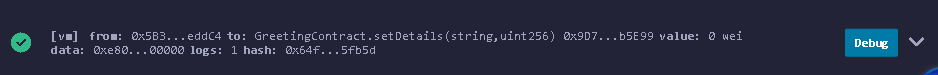
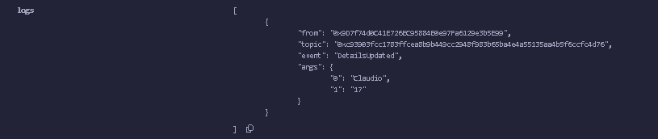

# Primeiro exemplo 'Hello World!'

## Hello World

Declara uma variável pública message com o valor inicial "Hello, World!"

```solidity
pragma solidity ^0.8.0;

contract HelloWorld {
    string public message = "Hello, World!";

    function getMessage() public view returns (string memory) {
        return message;
    }

    function setMessage(string memory newMessage) public {
        message = newMessage;
    }
}
```

## Explicando

Este contrato:

- Usa a versão 0.8.0 ou superior do Solidity
- Tem uma função getMessage que retorna o valor atual da mensagem
- Tem uma função setMessage que permite atualizar a mensagem

### 'public view return'

Na Solidity, a construção `public view returns` é usada em funções para definir sua visibilidade, comportamento e tipo de retorno. Vamos quebrar cada parte:

1. **public**: Especifica a visibilidade da função, indicando que ela pode ser chamada tanto internamente (dentro do contrato) quanto externamente (por outros contratos, carteiras ou aplicações).

>Funções `public` são acessíveis por qualquer pessoa ou contrato na blockchain.

2. **view**:É um modificador que indica que a função é apenas de leitura. Ela não modifica o estado da blockchain (não altera variáveis de estado, não emite eventos, não cria novos contratos, etc.).

>Funções `view` não consomem gás quando chamadas externamente, pois apenas leem dados da blockchain.

Exemplos de operações permitidas: ler variáveis de estado, retornar valores calculados com base em dados da blockchain, ou acessar informações como `block.number`.

3. **returns**:

- Define o tipo de dado que a função retorna. Após `returns`, você especifica o tipo (por exemplo, `string`, `uint`, `bool`, etc.). No caso do exemplo anterior, `returns (string memory)` indica que a função `getMessage` retorna uma string armazenada na memória (o modificador `memory` é necessário para tipos de dados complexos como strings ou arrays em Solidity).

### memory

Define um local de armazenamento temporário na blockchain Ethereum.

>Dados em memory existem apenas durante a execução de uma função e são descartados após sua conclusão.

Em Solidity, variáveis de tipos complexos (como string, array, struct) precisam de um especificador de armazenamento (como memory, storage ou calldata) quando declaradas em funções.
Para strings, memory é comumente usado em funções que manipulam ou retornam strings,

Por que memory?

Quando uma função retorna ou manipula uma string, ela precisa alocar espaço para essa string. O modificador memory diz à Solidity para armazenar essa string temporariamente na memória, em vez de persistir no armazenamento da blockchain (storage), que é mais caro e permanente.
>Usar memory é necessário para evitar erros de compilação em Solidity, já que o compilador precisa saber onde alocar tipos de dados complexos.

Outros locais de armazenamento:

- Storage: Usado para variáveis de estado persistentes no contrato (como a variável message no exemplo). Dados em storage são gravados na blockchain e persistem entre chamadas.

- Calldata: Usado para dados de entrada de funções (como parâmetros) que são apenas leitura e não persistem. É mais eficiente em termos de gás para chamadas externas.

## OlaContract

### Análise do contrato

```solidity
// SPDX-License-Identifier: MIT
pragma solidity ^0.8.0;

import "@openzeppelin/contracts/utils/Strings.sol";

contract OlaContract {
    string public nome;
    uint public idade;


    // Declaração do evento
    event DetailsUpdated(string nome, uint idade);

    // Função para definir nome e idade
    function setDetails(string calldata _nome, uint _idade) public {
        require(bytes(_nome).length > 0, unicode"Nome nao pode ser vazio");
        require(_idade > 0, "Idade deve ser maior que zero");
        nome = _nome;
        idade = _idade;
         // Emissão do evento
        emit DetailsUpdated(_nome, _idade);
    }

    // Função para retornar uma mensagem de cumprimento
    function dizerOla() public view returns (string memory) {
        return string(abi.encodePacked(unicode"Olá,", nome, unicode"! Você tem ", Strings.toString(idade), " anos."));
    }
}
```

1. **Licença e versão**:
   - `SPDX-License-Identifier: MIT`: Define a licença do contrato como MIT, que é padrão para contratos reutilizáveis.
   - `pragma solidity ^0.8.0`: Especifica que o contrato é compatível com Solidity versão 0.8.0 ou superior.

2. **Importação**:
   - `import "@openzeppelin/contracts/utils/Strings.sol";`: Importa a biblioteca `Strings` da OpenZeppelin, que fornece a função `toString` para converter `uint256` em `string`.

3. **Variáveis de estado**:
   - `string public name`: Armazena o nome em `storage` (persistente na blockchain).
   - `uint public age`: Armazena a idade como um inteiro sem sinal em `storage`.

4. **Função `setDetails`**:
   - Recebe um nome (`_name` como `calldata` para eficiência) e uma idade (`_age` como `uint`).
   - Atualiza as variáveis de estado `name` e `age`.

5. **Função `dizerOla`**:
   - É uma função `view` (só leitura, não modifica o estado).
   - Usa `abi.encodePacked` para concatenar strings e criar uma mensagem como "Olá, Alice! Você tem 25 anos.".
   - O modificador `unicode` é usado nas strings literais `"Olá,"` e `"! Você tem "` para suportar caracteres Unicode, como a vírgula com acento em "Olá,". Isso é útil para garantir a codificação correta de caracteres especiais.
   - `Strings.toString(age)` converte a idade em uma string.
   - Retorna a mensagem concatenada como `string memory` (armazenada temporariamente na memória).

### Sobre o uso de `unicode`

O prefixo `unicode` antes de strings literais (ex.: `unicode"Olá,"`) foi introduzido em Solidity para permitir o uso de caracteres Unicode diretamente no código. Isso é importante para suportar caracteres não-ASCII, como acentos em português (ex.: "á" em "Olá").
Sem o `unicode`, strings literais são tratadas como UTF-8, mas podem causar problemas de codificação em algumas ferramentas ou interfaces. O uso explícito de `unicode` garante compatibilidade e legibilidade.

### `require`

Require é uma função de controle de fluxo em Solidity que verifica se uma condição é verdadeira. Se for falsa, a transação é revertida, o estado da blockchain não é alterado, e qualquer gás usado até aquele ponto é consumido, mas o restante é devolvido.

>Se a condição do require falhar, a execução para imediatamente, evitando o consumo desnecessário de gás em operações subsequentes.

Sintaxe:

```solidity
require(condição, "mensagem de erro");
```

- condição: Uma expressão booleana que deve ser true para a execução continuar.
- "mensagem de erro": Uma string opcional que descreve o motivo da falha, retornada ao chamador em caso de erro.

Outros detalhes:

- `bytes(_nome).length > 0`:A função bytes() converte a string em um array de bytes, permitindo verificar seu comprimento.

### eventos

Eventos são mecanismos em Solidity para registrar ações ou mudanças de estado na blockchain. Eles são emitidos pelo contrato e armazenados nos logs da transação, permitindo que aplicações externas (como dApps, carteiras ou indexadores como The Graph) sejam notificadas.

>Eventos são armazenados nos logs da blockchain, que são mais baratos em termos de gás do que armazenar dados em variáveis de estado.

Podem ser indexados (até três parâmetros por evento) para facilitar buscas por ferramentas externas.

>Não podem ser lidos diretamente pelo contrato que os emite, mas são acessíveis por aplicações externas via bibliotecas como Web3.js ou ethers.js.

#### Como o evento funciona no contrato

1. Declaração do evento:
event DetailsUpdated(string name, uint age);
Define um evento chamado DetailsUpdated com dois parâmetros: name (string) e age (uint).
Esses parâmetros são os dados que serão registrados nos logs da blockchain quando o evento for emitido.
2. Emissão do evento:
emit DetailsUpdated(_name,_age);
Na função setDetails, após as validações com require e a atualização das variáveis name e age, o evento é emitido.
O emit registra os valores atuais de _name e_age nos logs da transação.
3. O que acontece na blockchain:
Quando setDetails é chamado (ex.: setDetails("Alice", 25)), o evento DetailsUpdated é incluído nos logs da transação.

4. Os logs contêm:

- O nome do evento (DetailsUpdated).
- Os parâmetros ("Alice", 25).
- Informações sobre a transação, como o endereço do contrato e o hash da transação.

>Esses logs podem ser acessados por ferramentas externas para reagir à atualização (ex.: atualizar uma interface de usuário).

5. Verifique a seção de Logs no console do Remix. Você verá algo como:



clicar no botão deploy para ver o log



O evento DetailsUpdated notifica mudanças em name e age, emitido após as validações com require.
Ele é útil para rastrear atualizações e integrar com aplicações externas.
O custo de gás é baixo, e os logs são permanentes na blockchain, permitindo consultas futuras.
