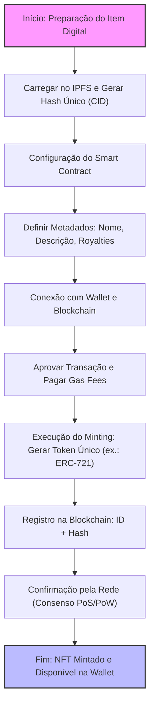

# NFT (ERC 721)

## 1. **Definição Básica**
NFT é a sigla para *Non-Fungible Token*, que em português pode ser traduzido como "Token Não Fungível". Para entender isso, precisamos diferenciar "fungível" de "não fungível":

- **Fungível**: Algo que pode ser trocado por outro item idêntico sem perda de valor. Por exemplo, uma nota de R$10 é fungível porque você pode trocá-la por outra nota de R$10 e nada muda.
- **Não fungível**: Algo único, que não pode ser substituído por outro exatamente igual. Pense em uma obra de arte original, como a Mona Lisa: mesmo uma cópia perfeita não tem o mesmo valor ou autenticidade.

Um NFT é, essencialmente, um certificado digital de propriedade e autenticidade para um item único, registrado em uma blockchain (uma espécie de livro-razão digital descentralizado e imutável). Ele representa algo exclusivo, como uma imagem, vídeo, música, item de jogo ou até mesmo um imóvel virtual.

## 2. **Caraterísticas**
Os NFTs são construídos sobre tecnologias de blockchain, principalmente a Ethereum (embora existam em outras como Solana ou Polygon para reduzir custos). Aqui vai o mecanismo principal:

- **Blockchain e Smart Contracts**: Um NFT é criado usando contratos inteligentes (smart contracts), que são programas autoexecutáveis na blockchain. Quando você "cunha" (mint) um NFT, ele recebe um identificador único (como um código hash) que prova sua originalidade e rastreia sua história de propriedade.
  
- **Padrões Técnicos**: A maioria dos NFTs segue padrões como o ERC-721 (para itens únicos) ou ERC-1155 (para itens semi-fungíveis) na Ethereum. Isso garante interoperabilidade entre plataformas.

- **Propriedade vs. Direitos**: Importante notar: possuir um NFT significa que você tem o direito de propriedade sobre o token digital, mas não necessariamente sobre o conteúdo subjacente. Por exemplo, se você compra um NFT de uma imagem, você pode revender o token, mas a imagem em si pode ser copiada por qualquer um (a menos que haja cláusulas legais adicionais).

## 3. **História e Surgimento**
O conceito de NFTs ganhou tração por volta de 2017 com projetos como CryptoKitties, um jogo onde você coleciona e reproduz gatos virtuais únicos. Mas o boom veio em 2021, com vendas milionárias, como a obra de arte digital "Everydays: The First 5000 Days" do artista Beeple, vendida por US$69 milhões em um leilão da Christie's. Isso popularizou os NFTs no mundo da arte, música (álbuns de Kings of Leon) e colecionáveis (como NBA Top Shot para clipes de basquete).

Desde então, o mercado oscilou: houve um "hype" seguido de uma queda em 2022 devido a bolhas especulativas e preocupações ambientais (o alto consumo de energia da mineração de blockchain). Hoje, em 2025, os NFTs evoluíram para usos mais práticos, como certificados de autenticidade para produtos físicos (ex.: tênis da Nike com NFT) ou ingressos para eventos.

## 4. **Criação de um NFT: O Processo de "Minting"**

"Mintar" um NFT significa criar o token digital. Isso é feito usando "smart contracts".
  
  - Passo 1: O criador (ex.: um artista) carrega o item digital (uma imagem, vídeo etc.) em um armazenamento descentralizado, como IPFS (InterPlanetary File System), que gera um hash único para o arquivo.
  
  - Passo 2: O smart contract gera o NFT, atribuindo-lhe:
    - Um ID único (como um número de série).
    - Metadados: Descrição, link para o item (o hash do IPFS), e regras (ex.: royalties de 10% em revendas).
    
    Isso segue padrões como ERC-721: cada NFT é indivisível e único, ao contrário de criptomoedas fungíveis como Bitcoin (onde 1 BTC = 1 BTC).

- **Registro na Blockchain**: O minting é uma transação: você paga uma taxa (gas fee) para que mineradores/validadores adicionem isso à blockchain. Agora, o NFT existe como um entrada imutável: "Este token #123 pertence a Endereço X e representa esta imagem única."



## 3. **Funcionamento da Propriedade e Autenticidade**
Aqui entra o cerne: como o NFT prova propriedade e autenticidade.

- **Propriedade**: 
  - O NFT é associado a uma "carteira" (wallet), um endereço criptográfico único (ex.: 0xABC...).
  - Transferir propriedade? Basta uma transação: "Envie o NFT de Wallet A para Wallet B". Isso é registrado na blockchain, visível publicamente. Ninguém pode roubar sem a chave privada da wallet (como uma senha ultra-segura).
  - Exemplo: Se você compra um NFT de uma música, você "possui" o token. Pode vendê-lo em marketplaces como OpenSea, e o smart contract cuida da transferência automática.

- **Autenticidade**:
  - A imutabilidade da blockchain garante que a história do NFT é rastreável: quem criou, quem possuiu, quantas vezes foi vendido.
  - O hash liga o NFT ao item original. Mesmo se alguém copiar a imagem, o NFT original permanece único — como ter o quadro original vs. uma foto dele.
  - Verificação: Qualquer um pode consultar a blockchain (via exploradores como Etherscan) para confirmar: "Sim, este NFT é autêntico, criado por Beeple em 2021."

- **Representação de Itens Exclusivos**:
  - Para uma imagem: O NFT aponta para o arquivo via hash, mas o arquivo em si pode estar em IPFS ou até em servidores centralizados.
  - Para um item de jogo: Em jogos como Axie Infinity, o NFT representa um personagem único com atributos raros.
  - Para imóvel virtual: No metaverso (ex.: The Sandbox), o NFT é o "título" de uma parcela de terra digital, que você pode construir ou alugar.

## 4. **Limitações e Considerações Práticas**
Como em qualquer tecnologia, há nuances:
- **Não é Propriedade Absoluta**: O NFT dá direitos sobre o token, mas direitos autorais do conteúdo dependem de leis tradicionais. Copiar uma imagem NFT não viola o token, mas pode violar copyright.
- **Custos e Escalabilidade**: Taxas de transação variam; em picos, podem ser altas. Redes como Polygon resolvem isso com camadas secundárias.
- **Segurança**: Perca sua chave privada? Adeus NFT. Há hacks em wallets, mas a blockchain em si é segura.
- **Evolução**: Em 2025, NFTs integram mais com Web3, como em DAOs (organizações autônomas) ou identidades digitais.

Em essência, o NFT transforma o intangível em algo tangível digitalmente, graças à blockchain como espinha dorsal. É uma ponte entre o mundo físico e virtual, com potencial para revolucionar indústrias. 

Ah, ótima pergunta! Vamos explorar o conceito de IPFS de forma organizada, como faríamos em uma aula sobre redes distribuídas e tecnologias web descentralizadas. Vou explicar passo a passo, começando pelo básico e avançando para o funcionamento técnico, aplicações e implicações. Como você mencionou isso no contexto de NFTs, vou conectar os pontos onde relevante.

## 5. **IPFS**
IPFS é a sigla para *InterPlanetary File System*, que pode ser traduzido como "Sistema de Arquivos Interplanetário". Criado pela Protocol Labs em 2015, o IPFS é um protocolo e rede peer-to-peer (P2P) projetado para armazenar, compartilhar e acessar dados de forma descentralizada. Em vez de depender de servidores centrais (como no HTTP tradicional, onde arquivos são hospedados em um único local), o IPFS distribui os arquivos pela rede global de participantes.

Pense nele como uma "internet de arquivos" eterna e resistente a falhas: em vez de URLs baseados em localização (ex.: https://exemplo.com/arquivo.jpg), o IPFS usa endereços baseados no conteúdo do arquivo em si. Isso significa que os dados são identificados por seu hash criptográfico único, garantindo que o arquivo seja imutável e verificável.

## 6. **Como Funciona Tecnicamente**
Para entender o IPFS, vamos quebrar em componentes chave:

- **Endereçamento Baseado em Conteúdo (Content-Addressing)**:
  - Quando você carrega um arquivo no IPFS, ele é dividido em blocos menores (tipicamente 256 KB cada).
  - Cada bloco recebe um hash criptográfico (geralmente CID - Content Identifier, baseado em SHA-256 ou similares). O hash é como uma "impressão digital" única do conteúdo: se o arquivo mudar uma vírgula, o hash muda completamente.
  - O endereço do arquivo inteiro é o hash da raiz (um Merkle DAG - Directed Acyclic Graph), que referencia todos os blocos. Exemplo: um CID pode ser algo como `QmXk...` (em base58) ou `bafy...` (em base32 para IPFS moderno).

- **Rede Peer-to-Peer**:
  - Os arquivos são armazenados e compartilhados por "nós" (computadores ou dispositivos na rede IPFS).
  - Quando você solicita um arquivo, o IPFS usa um DHT (Distributed Hash Table) para encontrar nós que possuam os blocos necessários. É como um BitTorrent avançado: os dados são baixados de múltiplas fontes simultaneamente, aumentando a velocidade e a resiliência.
  - Não há um servidor central; se um nó cair, outros assumem. Isso torna o IPFS resistente a censura, downtime e ataques DDoS.

- **Integração com Gateways**:
  - Para acessar arquivos IPFS via navegador comum, usa-se gateways como ipfs.io ou dweb.link. Exemplo: https://ipfs.io/ipfs/QmXk... abre o arquivo.
  - No entanto, o ideal é rodar um nó IPFS local (via software como Kubo) para acesso direto.

- **Pinning e Persistência**:
  - Arquivos não são armazenados para sempre automaticamente; nós podem "pin" (fixar) arquivos para mantê-los disponíveis. Serviços como Pinata ou Filecoin (uma blockchain integrada ao IPFS) oferecem pinning pago para garantir persistência.

O IPFS transforma a web de "localização-dependente" para "conteúdo-dependente", promovendo uma internet mais distribuída e eficiente.

## 7. **Relação com NFTs e Blockchain**

- O NFT na blockchain (como Ethereum) armazena apenas o hash ou CID do arquivo, não o arquivo em si (para evitar inchaço na chain).
- Isso garante que o conteúdo seja imutável: se alguém alterar o arquivo, o hash não bate, provando falsificação.
- Exemplos: Plataformas como OpenSea ou Rarible usam IPFS para hospedar artes NFT, tornando-as acessíveis globalmente sem servidores centrais.

Isso resolve problemas da web tradicional, como links quebrados (o famoso "404 Not Found"), pois o conteúdo é referenciado pelo que é, não pelo onde está.

## 8. **Aplicações Práticas e Exemplos**
- **Armazenamento Descentralizado**: Sites inteiros podem ser hospedados no IPFS (ex.: via ENS - Ethereum Name Service).
- **Conteúdo Científico**: Projetos como arXiv ou Wikipedia usam IPFS para backups imutáveis.
- **Mídia e Arte**: Plataformas como Audius (música) ou descentralizadas para vídeos.
- **Experimente Você Mesmo**: Instale o IPFS Desktop (gratuito), carregue um arquivo e veja o CID gerado. Acesse via gateway para testar.


## 9. **Código de Exemplo em Solidity**

Código completo para o contrato "DigitalArtCollection". Ele herda de ERC721URIStorage para incluir metadados por token. 

```solidity
// contracts/DigitalArtCollection.sol
// SPDX-License-Identifier: MIT
pragma solidity ^0.8.20;

import {ERC721URIStorage, ERC721} from "@openzeppelin/contracts/token/ERC721/extensions/ERC721URIStorage.sol";
import {Ownable} from "@openzeppelin/contracts/access/Ownable.sol";

contract DigitalArtCollection is ERC721URIStorage, Ownable {
    uint256 private _nextTokenId;  // Contador para gerar IDs únicos sequencialmente

    // Construtor: Define o nome da coleção ("DigitalArtCollection") e o símbolo ("DAC")
    constructor() ERC721("DigitalArtCollection", "DAC") Ownable(msg.sender) {}

    // Função para mintar uma nova obra de arte
    // Parâmetros: Endereço do destinatário inicial e URI de metadados (ex.: JSON com nome, descrição e imagem no IPFS)
    // Apenas o dono do contrato pode chamar essa função
    function mintArt(address to, string memory tokenURI) public onlyOwner returns (uint256) {
        uint256 tokenId = _nextTokenId++;  // Gera um ID único
        _mint(to, tokenId);  // Atribui o token ao destinatário
        _setTokenURI(tokenId, tokenURI);  // Armazena os metadados associados ao token

        return tokenId;
    }

    // Sobrescreve supportsInterface para compatibilidade com múltiplas heranças
    function supportsInterface(bytes4 interfaceId) public view override(ERC721URIStorage) returns (bool) {
        return super.supportsInterface(interfaceId);
    }
}
```

- **Herança**: Usa `ERC721URIStorage` para funcionalidades ERC-721 básicas mais armazenamento de URIs (ex.: "ipfs://Qm.../metadata.json").
- **Minting**: A função `mintArt` cria um novo NFT, atribui ao endereço especificado e define metadados. IDs são sequenciais para simplicidade.
- **Segurança**: `onlyOwner` restringe a criação de novos tokens ao deployer do contrato.
- **Uso Prático**: Após deploy, você poderia mintar um NFT com URI apontando para um JSON como: `{"name": "Arte Abstrata #1", "description": "Pintura digital única", "image": "ipfs://Qm.../image.png"}`.


| Característica | Tipo | Descrição Obrigatória |
|---------------|------|-----------------------|
| **balanceOf(address owner)** | Função | Retorna o número de tokens que o endereço `owner` possui. Deve reverter se `owner` for o endereço zero. |
| **ownerOf(uint256 tokenId)** | Função | Retorna o endereço do proprietário do token com ID `tokenId`. Deve reverter se o token não existir. |
| **approve(address to, uint256 tokenId)** | Função | Aprova o endereço `to` para transferir o token `tokenId`. Apenas o dono ou operador aprovado pode chamar. |
| **getApproved(uint256 tokenId)** | Função | Retorna o endereço aprovado para transferir o token `tokenId`, ou zero se nenhum. |
| **setApprovalForAll(address operator, bool approved)** | Função | Define ou revoga aprovação para que `operator` gerencie todos os tokens do chamador. |
| **isApprovedForAll(address owner, address operator)** | Função | Retorna se `operator` está aprovado para gerenciar todos os tokens de `owner`. |
| **transferFrom(address from, address to, uint256 tokenId)** | Função | Transfere o token de `from` para `to`. Deve verificar aprovações e reverter se inválido. |
| **safeTransferFrom(address from, address to, uint256 tokenId)** | Função | Versão segura da transferência, que verifica se `to` é um contrato que suporta ERC-721 (via onERC721Received). Há uma sobrecarga com dados adicionais. |
| **Transfer(address from, address to, uint256 tokenId)** | Evento | Emitido em toda transferência, incluindo mint (from=0) e burn (to=0). |
| **Approval(address owner, address approved, uint256 tokenId)** | Evento | Emitido quando uma aprovação para um token específico é definida ou revogada. |
| **ApprovalForAll(address owner, address operator, bool approved)** | Evento | Emitido quando aprovações gerais são definidas ou revogadas. |
| **supportsInterface(bytes4 interfaceId)** | Função (de IERC165) | Deve retornar true para o ID da interface ERC-721 (0x80ac58cd) e IERC165 (0x01ffc9a7). |

## 10. **Introdução aos Metadados JSON para NFTs**
 Eles permitem que plataformas como OpenSea, Rarible ou wallets exibam detalhes visuais e textuais do token, como nome, imagem e atributos. O padrão mais adotado é o de metadados ERC-721, inspirado na OpenSea, que usa um arquivo JSON simples e estruturado. Isso garante interoperabilidade: qualquer marketplace pode ler e renderizar o NFT corretamente.

Esses metadados são cruciais porque transformam um simples ID numérico em algo tangível e atraente, como uma obra de arte com descrição e traços únicos. Geralmente, o JSON é hospedado em IPFS para imutabilidade, gerando uma URI como "ipfs://Qm.../metadata.json".

## 11. **Estrutura Básica dos Metadados**
Um arquivo JSON de metadados para NFT deve incluir campos chave. Aqui vai uma visão geral dos mais comuns e recomendados (não todos são obrigatórios, mas ajudam na compatibilidade):

- **name**: Nome do NFT (string, obrigatório para exibição).
- **description**: Descrição detalhada (string, recomendada para contexto).
- **image**: URL da imagem principal (string, geralmente IPFS ou HTTP; essencial para visualização).
- **external_url**: Link para uma página externa, como o site do criador (string, opcional).
- **attributes**: Array de objetos representando traços ou propriedades (ex.: raridade, cor), no formato `{ "trait_type": "Nome", "value": "Valor" }`. Útil para filtros em marketplaces.
- **background_color**: Cor de fundo em hexadecimal (string, opcional para renderização).
- **animation_url**: URL para animação ou vídeo (string, opcional para NFTs multimídia).
- **properties**: Objeto adicional para metadados personalizados (opcional).

O JSON deve ser válido e UTF-8, com campos sensíveis a maiúsculas/minúsculas.

## 12. **Exemplo de Metadados JSON**
Vamos usar um exemplo baseado na nossa coleção fictícia "DigitalArtCollection", imaginando um NFT de uma obra de arte abstrata chamada "Cosmic Vortex #1". Suponha que a imagem e o JSON estejam hospedados no IPFS. Aqui está o arquivo JSON completo:

```json
{
  "name": "Cosmic Vortex #1",
  "description": "Uma obra de arte digital abstrata representando um vórtice cósmico, gerada por algoritmos de IA. Esta peça única explora temas de infinito e energia universal, com cores vibrantes e formas fluidas. Parte da coleção DigitalArtCollection, edição limitada.",
  "image": "ipfs://QmXYZ1234567890abcdef/image.png",
  "external_url": "https://meusite.com/arte/cosmic-vortex-1",
  "attributes": [
    {
      "trait_type": "Artista",
      "value": "IA Criativa"
    },
    {
      "trait_type": "Estilo",
      "value": "Abstrato"
    },
    {
      "trait_type": "Raridade",
      "value": "Épica"
    },
    {
      "trait_type": "Cor Primária",
      "value": "Azul Cósmico"
    },
    {
      "display_type": "number",
      "trait_type": "Geração",
      "value": 1
    }
  ],
  "background_color": "000000",
  "animation_url": "ipfs://QmXYZ1234567890abcdef/animation.mp4"
}
```


- **name e description**: Fornecem identidade e narrativa, essenciais para engajamento.
- **image**: Aponta para o arquivo visual (substitua "QmXYZ..." por um hash IPFS real).
- **attributes**: Permitem categorização; o campo "display_type" (ex.: "number") indica como renderizar (opcional, mas útil para valores numéricos).
- **Outros campos**: Adicionam interatividade, como animação para um efeito dinâmico.

Em um contrato Solidity como o nosso anterior, ao mintar, você passaria a URI desse JSON para `_setTokenURI(tokenId, "ipfs://Qm.../metadata.json")`.

## 13. **Introdução aos Serviços IPFS**
Prezado aluno, retomando nossa conversa sobre o IPFS (InterPlanetary File System), que é um protocolo descentralizado para armazenamento e compartilhamento de arquivos, vamos discutir os serviços associados a ele. Esses serviços facilitam o uso prático do IPFS, resolvendo desafios como persistência de dados (pinning), acesso via gateways, integração com blockchains e desenvolvimento de aplicações. Eles incluem provedores de pinning (para manter arquivos disponíveis), gateways públicos, plataformas de armazenamento integrado e ferramentas de desenvolvimento.

Em 2025, o ecossistema IPFS continua evoluindo, impulsionado pela Web3 e pela integração com redes como Filecoin. Abaixo, listo os principais serviços com base em fontes atualizadas, categorizados para clareza. Vou focar em serviços de pinning e armazenamento, pois são os mais comuns, mas menciono outros tipos.

Os serviços podem ser divididos em:
- **Pinning Services**: Garantem que arquivos permaneçam acessíveis na rede IPFS, evitando remoção por falta de uso.
- **Gateways**: Portais para acessar conteúdo IPFS via HTTP, úteis para usuários sem nós locais.
- **Plataformas Integradas**: Combinam IPFS com armazenamento blockchain ou cloud descentralizado.
- **Ferramentas de Desenvolvimento**: APIs e kits para construir apps sobre IPFS.
- **Comunidade e Listas**: Repositórios como o "Awesome IPFS" no GitHub, que agregam projetos e ferramentas.

Aqui vai uma tabela resumindo os serviços mais relevantes, com descrições breves, foco principal e exemplos de uso. Baseio-me em listas de provedores confiáveis, priorizando pinning services, que são centrais para NFTs e metadados, como discutimos.

| Serviço          | Tipo Principal       | Descrição Breve                                                                 | Exemplos de Uso                          |
|------------------|----------------------|---------------------------------------------------------------------------------|------------------------------------------|
| **QuickNode**   | Pinning e API       | Provedor de infraestrutura blockchain com suporte a IPFS para pinning e acesso rápido. | Integração com dApps e NFTs.            |
| **Filebase**    | Pinning e Armazenamento | Serviço de pinning dedicado, compatível com S3, para arquivos IPFS e Sia/Filecoin. | Armazenamento descentralizado para devs. |
| **Eternum**     | Pinning             | Focado em persistência eterna de dados IPFS, com opções empresariais.          | Arquivamento de conteúdo digital.        |
| **DAppNode**    | Pinning e Nó        | Plataforma para rodar nós IPFS locais ou em rede, facilitando pinning distribuído. | Desenvolvimento de apps descentralizados.|
| **Infura**      | Pinning e Gateway   | Serviço da ConsenSys para IPFS, com APIs para upload e pinning em escala.      | Integração com Ethereum e Web3.          |
| **Kaleido**     | Pinning Empresarial | Plataforma blockchain-as-a-service com suporte IPFS para empresas.              | Soluções corporativas e consórcios.      |
| **Fleek**       | Pinning e Hosting   | Hospedagem de sites e arquivos IPFS, com pinning automático e integração ENS.  | Construção de sites Web3.                |
| **Space**       | Armazenamento Descentralizado | Integra IPFS com armazenamento peer-to-peer, focado em privacidade.             | Compartilhamento de arquivos seguros.    | 
| **Pinata**      | Pinning             | Um dos mais populares para NFTs, com APIs simples para upload e gerenciamento. | Metadados e imagens para coleções NFT.   | 
| **CIDgravity**  | Pinning Avançado    | Serviço especializado em gerenciamento de CIDs e pinning escalável.            | Otimização para grandes volumes de dados.|
| **Zetta**       | Armazenamento       | Plataforma que usa IPFS para armazenamento de alta performance.                 | Aplicações de big data descentralizadas. |
| **Slik Safe**   | Armazenamento Rápido| Focado em experiência rápida de arquivos via IPFS.                              | Backup e compartilhamento pessoal.       |
| **ipfs.io**     | Gateway Público     | Gateway oficial mantido pela Protocol Labs para acessar conteúdo IPFS.         | Visualização rápida de arquivos.         |
| **Filecoin**    | Armazenamento Integrado | Rede de armazenamento que complementa IPFS, com incentivos econômicos.         | Armazenamento persistente e pago.        |


