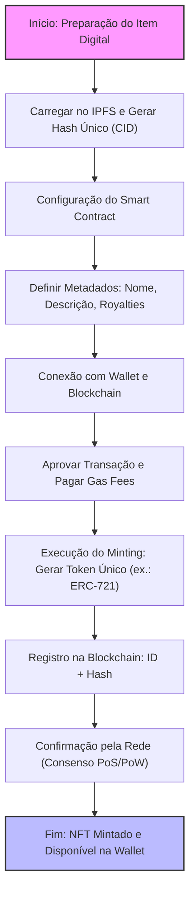

# NFT (ERC 721)

## 1. **Definição Básica**
NFT é a sigla para *Non-Fungible Token*, que em português pode ser traduzido como "Token Não Fungível". Para entender isso, precisamos diferenciar "fungível" de "não fungível":

- **Fungível**: Algo que pode ser trocado por outro item idêntico sem perda de valor. Por exemplo, uma nota de R$10 é fungível porque você pode trocá-la por outra nota de R$10 e nada muda.
- **Não fungível**: Algo único, que não pode ser substituído por outro exatamente igual. Pense em uma obra de arte original, como a Mona Lisa: mesmo uma cópia perfeita não tem o mesmo valor ou autenticidade.

Um NFT é, essencialmente, um certificado digital de propriedade e autenticidade para um item único, registrado em uma blockchain (uma espécie de livro-razão digital descentralizado e imutável). Ele representa algo exclusivo, como uma imagem, vídeo, música, item de jogo ou até mesmo um imóvel virtual.

## 2. **Caraterísticas**
Os NFTs são construídos sobre tecnologias de blockchain, principalmente a Ethereum (embora existam em outras como Solana ou Polygon para reduzir custos). Aqui vai o mecanismo principal:

- **Blockchain e Smart Contracts**: Um NFT é criado usando contratos inteligentes (smart contracts), que são programas autoexecutáveis na blockchain. Quando você "cunha" (mint) um NFT, ele recebe um identificador único (como um código hash) que prova sua originalidade e rastreia sua história de propriedade.
  
- **Padrões Técnicos**: A maioria dos NFTs segue padrões como o ERC-721 (para itens únicos) ou ERC-1155 (para itens semi-fungíveis) na Ethereum. Isso garante interoperabilidade entre plataformas.

- **Propriedade vs. Direitos**: Importante notar: possuir um NFT significa que você tem o direito de propriedade sobre o token digital, mas não necessariamente sobre o conteúdo subjacente. Por exemplo, se você compra um NFT de uma imagem, você pode revender o token, mas a imagem em si pode ser copiada por qualquer um (a menos que haja cláusulas legais adicionais).

## 3. **História e Surgimento**
O conceito de NFTs ganhou tração por volta de 2017 com projetos como CryptoKitties, um jogo onde você coleciona e reproduz gatos virtuais únicos. Mas o boom veio em 2021, com vendas milionárias, como a obra de arte digital "Everydays: The First 5000 Days" do artista Beeple, vendida por US$69 milhões em um leilão da Christie's. Isso popularizou os NFTs no mundo da arte, música (álbuns de Kings of Leon) e colecionáveis (como NBA Top Shot para clipes de basquete).

Desde então, o mercado oscilou: houve um "hype" seguido de uma queda em 2022 devido a bolhas especulativas e preocupações ambientais (o alto consumo de energia da mineração de blockchain). Hoje, em 2025, os NFTs evoluíram para usos mais práticos, como certificados de autenticidade para produtos físicos (ex.: tênis da Nike com NFT) ou ingressos para eventos.

## 4. **Criação de um NFT: O Processo de "Minting"**

"Mintar" um NFT significa criar o token digital. Isso é feito usando "smart contracts".
  
  - Passo 1: O criador (ex.: um artista) carrega o item digital (uma imagem, vídeo etc.) em um armazenamento descentralizado, como IPFS (InterPlanetary File System), que gera um hash único para o arquivo.
  
  - Passo 2: O smart contract gera o NFT, atribuindo-lhe:
    - Um ID único (como um número de série).
    - Metadados: Descrição, link para o item (o hash do IPFS), e regras (ex.: royalties de 10% em revendas).
    
    Isso segue padrões como ERC-721: cada NFT é indivisível e único, ao contrário de criptomoedas fungíveis como Bitcoin (onde 1 BTC = 1 BTC).

- **Registro na Blockchain**: O minting é uma transação: você paga uma taxa (gas fee) para que mineradores/validadores adicionem isso à blockchain. Agora, o NFT existe como um entrada imutável: "Este token #123 pertence a Endereço X e representa esta imagem única."

## 3. **Funcionamento da Propriedade e Autenticidade**
Aqui entra o cerne: como o NFT prova propriedade e autenticidade.

- **Propriedade**: 
  - O NFT é associado a uma "carteira" (wallet), um endereço criptográfico único (ex.: 0xABC...).
  - Transferir propriedade? Basta uma transação: "Envie o NFT de Wallet A para Wallet B". Isso é registrado na blockchain, visível publicamente. Ninguém pode roubar sem a chave privada da wallet (como uma senha ultra-segura).
  - Exemplo: Se você compra um NFT de uma música, você "possui" o token. Pode vendê-lo em marketplaces como OpenSea, e o smart contract cuida da transferência automática.

- **Autenticidade**:
  - A imutabilidade da blockchain garante que a história do NFT é rastreável: quem criou, quem possuiu, quantas vezes foi vendido.
  - O hash liga o NFT ao item original. Mesmo se alguém copiar a imagem, o NFT original permanece único — como ter o quadro original vs. uma foto dele.
  - Verificação: Qualquer um pode consultar a blockchain (via exploradores como Etherscan) para confirmar: "Sim, este NFT é autêntico, criado por Beeple em 2021."

- **Representação de Itens Exclusivos**:
  - Para uma imagem: O NFT aponta para o arquivo via hash, mas o arquivo em si pode estar em IPFS ou até em servidores centralizados.
  - Para um item de jogo: Em jogos como Axie Infinity, o NFT representa um personagem único com atributos raros.
  - Para imóvel virtual: No metaverso (ex.: The Sandbox), o NFT é o "título" de uma parcela de terra digital, que você pode construir ou alugar.

## 4. **Limitações e Considerações Práticas**
Como em qualquer tecnologia, há nuances:
- **Não é Propriedade Absoluta**: O NFT dá direitos sobre o token, mas direitos autorais do conteúdo dependem de leis tradicionais. Copiar uma imagem NFT não viola o token, mas pode violar copyright.
- **Custos e Escalabilidade**: Taxas de transação variam; em picos, podem ser altas. Redes como Polygon resolvem isso com camadas secundárias.
- **Segurança**: Perca sua chave privada? Adeus NFT. Há hacks em wallets, mas a blockchain em si é segura.
- **Evolução**: Em 2025, NFTs integram mais com Web3, como em DAOs (organizações autônomas) ou identidades digitais.

Em essência, o NFT transforma o intangível em algo tangível digitalmente, graças à blockchain como espinha dorsal. É uma ponte entre o mundo físico e virtual, com potencial para revolucionar indústrias. 

Ah, ótima pergunta! Vamos explorar o conceito de IPFS de forma organizada, como faríamos em uma aula sobre redes distribuídas e tecnologias web descentralizadas. Vou explicar passo a passo, começando pelo básico e avançando para o funcionamento técnico, aplicações e implicações. Como você mencionou isso no contexto de NFTs, vou conectar os pontos onde relevante.

## 5. **IPFS**
IPFS é a sigla para *InterPlanetary File System*, que pode ser traduzido como "Sistema de Arquivos Interplanetário". Criado pela Protocol Labs em 2015, o IPFS é um protocolo e rede peer-to-peer (P2P) projetado para armazenar, compartilhar e acessar dados de forma descentralizada. Em vez de depender de servidores centrais (como no HTTP tradicional, onde arquivos são hospedados em um único local), o IPFS distribui os arquivos pela rede global de participantes.

Pense nele como uma "internet de arquivos" eterna e resistente a falhas: em vez de URLs baseados em localização (ex.: https://exemplo.com/arquivo.jpg), o IPFS usa endereços baseados no conteúdo do arquivo em si. Isso significa que os dados são identificados por seu hash criptográfico único, garantindo que o arquivo seja imutável e verificável.

## 6. **Como Funciona Tecnicamente**
Para entender o IPFS, vamos quebrar em componentes chave:

- **Endereçamento Baseado em Conteúdo (Content-Addressing)**:
  - Quando você carrega um arquivo no IPFS, ele é dividido em blocos menores (tipicamente 256 KB cada).
  - Cada bloco recebe um hash criptográfico (geralmente CID - Content Identifier, baseado em SHA-256 ou similares). O hash é como uma "impressão digital" única do conteúdo: se o arquivo mudar uma vírgula, o hash muda completamente.
  - O endereço do arquivo inteiro é o hash da raiz (um Merkle DAG - Directed Acyclic Graph), que referencia todos os blocos. Exemplo: um CID pode ser algo como `QmXk...` (em base58) ou `bafy...` (em base32 para IPFS moderno).

- **Rede Peer-to-Peer**:
  - Os arquivos são armazenados e compartilhados por "nós" (computadores ou dispositivos na rede IPFS).
  - Quando você solicita um arquivo, o IPFS usa um DHT (Distributed Hash Table) para encontrar nós que possuam os blocos necessários. É como um BitTorrent avançado: os dados são baixados de múltiplas fontes simultaneamente, aumentando a velocidade e a resiliência.
  - Não há um servidor central; se um nó cair, outros assumem. Isso torna o IPFS resistente a censura, downtime e ataques DDoS.

- **Integração com Gateways**:
  - Para acessar arquivos IPFS via navegador comum, usa-se gateways como ipfs.io ou dweb.link. Exemplo: https://ipfs.io/ipfs/QmXk... abre o arquivo.
  - No entanto, o ideal é rodar um nó IPFS local (via software como Kubo) para acesso direto.

- **Pinning e Persistência**:
  - Arquivos não são armazenados para sempre automaticamente; nós podem "pin" (fixar) arquivos para mantê-los disponíveis. Serviços como Pinata ou Filecoin (uma blockchain integrada ao IPFS) oferecem pinning pago para garantir persistência.

O IPFS transforma a web de "localização-dependente" para "conteúdo-dependente", promovendo uma internet mais distribuída e eficiente.

##7 3. **Relação com NFTs e Blockchain**

- O NFT na blockchain (como Ethereum) armazena apenas o hash ou CID do arquivo, não o arquivo em si (para evitar inchaço na chain).
- Isso garante que o conteúdo seja imutável: se alguém alterar o arquivo, o hash não bate, provando falsificação.
- Exemplos: Plataformas como OpenSea ou Rarible usam IPFS para hospedar artes NFT, tornando-as acessíveis globalmente sem servidores centrais.

Isso resolve problemas da web tradicional, como links quebrados (o famoso "404 Not Found"), pois o conteúdo é referenciado pelo que é, não pelo onde está.

### 4. **Vantagens e Desafios**
- **Vantagens**:
  - **Descentralização e Resiliência**: Dados sobrevivem a falhas de servidores ou censura governamental.
  - **Eficiência**: Reduz largura de banda, pois arquivos são cacheados localmente e compartilhados P2P.
  - **Imutabilidade**: Perfeito para arquivos que precisam de prova de integridade, como dados científicos ou arte digital.
  - **Integração com Web3**: Combina bem com blockchains, DAOs e metaversos.

- **Desafios**:
  - **Persistência**: Sem pinning, arquivos podem "desaparecer" se ninguém os hospedar.
  - **Desempenho**: Inicialmente mais lento que HTTP para arquivos não populares, mas melhora com mais nós.
  - **Privacidade**: Como é público, não é ideal para dados sensíveis (use criptografia adicional).
  - **Adoção**: Em 2025, o IPFS é amplamente usado em projetos Web3, mas ainda não substituiu o HTTP completamente. Iniciativas como Filecoin (para armazenamento incentivado) e IPFS Cluster (para gerenciamento) estão impulsionando o crescimento.

### 5. **Aplicações Práticas e Exemplos**
- **Armazenamento Descentralizado**: Sites inteiros podem ser hospedados no IPFS (ex.: via ENS - Ethereum Name Service).
- **Conteúdo Científico**: Projetos como arXiv ou Wikipedia usam IPFS para backups imutáveis.
- **Mídia e Arte**: Plataformas como Audius (música) ou descentralizadas para vídeos.
- **Experimente Você Mesmo**: Instale o IPFS Desktop (gratuito), carregue um arquivo e veja o CID gerado. Acesse via gateway para testar.

